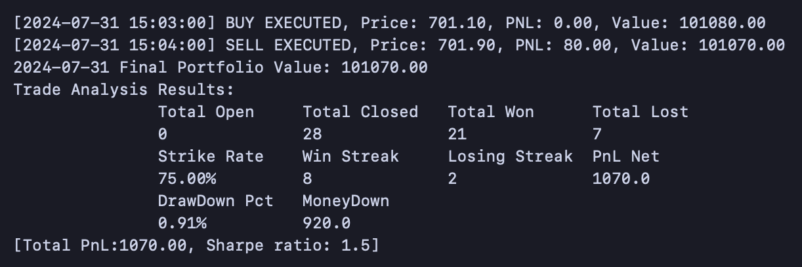

# Quant research with Amazon SageMaker

As a quant researcher, speed and efficiency are paramount. SageMaker provides fully managed Jupyter notebooks that allow you to focus on your analysis without worrying about infrastructure. You can scale your models effortlessly with SageMaker’s distributed training capabilities. With just a few lines of Python code, you can harness almost unlimited compute power, reducing training time from days to hours.

This example demonstrates how to load historical minute bar data and train an XGBoost model (or any time series model, such as GluonTS) easily on SageMaker. After training your ML model, you want to back test it to derive a trading strategy. This also demonstrates how to load historical minute bar data and back test the XGBoost model easily on SageMaker. 

The expected sample minute bar is as below. You can adjust the code to cater to your minute bar format.
| bucket | ticker | trades | open | high | low | close | volume | vwap | twap |
| --- | --- | --- | --- | --- | --- | --- | --- | --- | --- |
| 2024-07-01 07:00:00 | AAL.L | 46 | 2401.0 | 2431.5 | 2401.0 | 2423.0 | 72859 | 2402.990063 | 2425.252569 |
| 2024-07-01 07:01:00 | AAL.L | 128 | 2425.0 | 2429.5 | 2420.0 | 2425.5 | 12212 | 2425.881387 | 2425.991103 |
| 2024-07-01 07:02:00 | AAL.L | 19 | 2427.5 | 2427.5 | 2416.5 | 2416.5 | 1546 | 2418.197930 | 2423.425674 |
| 2024-07-01 07:03:00 | AAL.L | 83 | 2418.0 | 2418.5 | 2410.5 | 2416.0 | 8590 | 2414.251397 | 2415.928137 |

This example uses backtrader framework, and backtesting would generate the trading statistics and chart sample as below:

Please note that XGBoost is not inherently a time series model. You need to use techniques like sliding windows or lag features to adjust it for time series forecasting. Or you can use time series model such as [GluonTS](https://ts.gluon.ai/stable/), [ARIMA](https://www.investopedia.com/terms/a/autoregressive-integrated-moving-average-arima.asp) [SARIMA](https://ieeexplore.ieee.org/document/9609720/) or [DeepAR](https://docs.aws.amazon.com/sagemaker/latest/dg/deepar.html), which can handle both stationary and non-stationary time series data to captures complex patterns in data, including trends and seasonality. 

